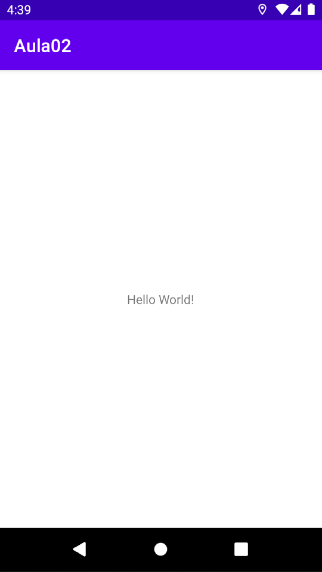
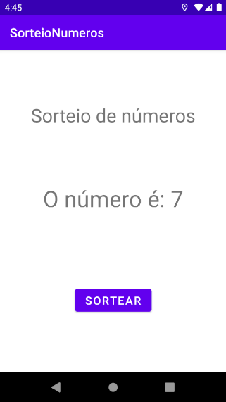
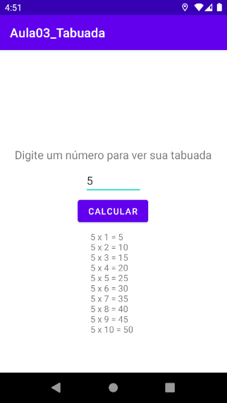
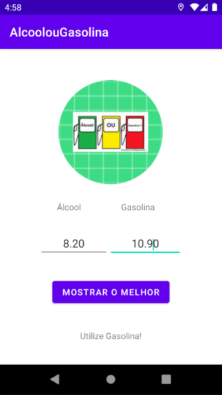
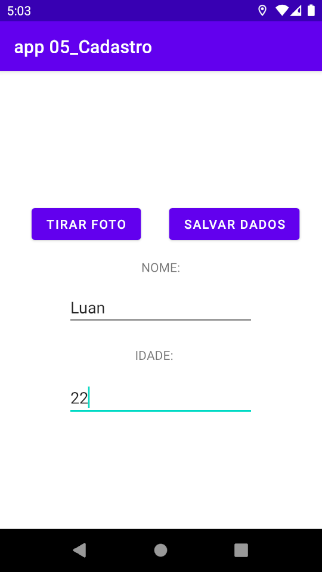

# Aplicativos desenvolvidos na aula de Programação para Dispositivos Móveis

## Tecnologias

Tecnologias e ferramentas utilizadas no desenvolvimento do projeto:

- [IntelliJ](https://www.jetbrains.com/pt-br/idea/)
- [Kotlin](https://kotlinlang.org/)

 

## Apps 

### Hello world

  

 

### Sorteio de Números

  

 

### Tabuada

  

 

### Alcool ou Gasolina

  

 

### Cadastro

  

 